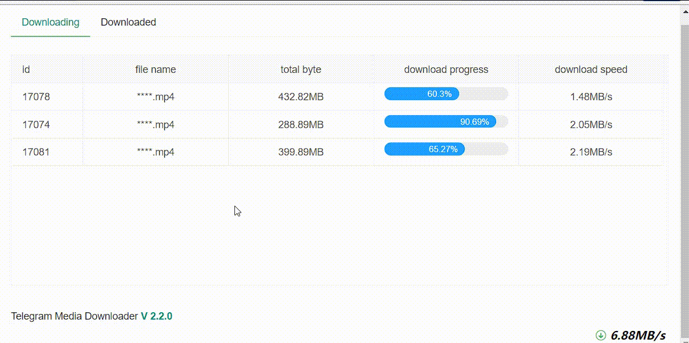
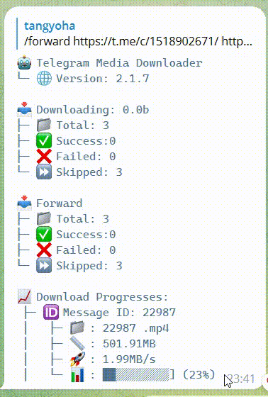

<h1 align="center">Telegram Media Downloader</h1>

<h3 align="center">
  <a href="./README_CN.md">中文</a>
</h3>

## Overview
> Support two default running

* The robot is running, and the command `download` or `forward` is issued from the robot

* Download as a one-time download tool

### UI

#### Web page

> After running, open a browser and visit `localhost:5000`
> If it is a remote machine, you need to configure web_host: 0.0.0.0




### Robot

> Need to configure `bot_token` before using the robot mode.



### Support

| Category             | Support                                          |
| -------------------- | ------------------------------------------------ |
| Language             | `Python 3.10`                                    |
| Download media types | audio, document, photo, video, video_note, voice |

## Installation

After cloning this repository, enter its directory and create the Conda environment:

```powershell
git clone https://github.com/xizi2333/telegram_media_downloader.git
cd telegram_media_downloader
conda env create -f environment.yml
conda activate telegram
Copy-Item config.example.yaml config.yaml
python media_downloader.py
```

If the `telegram` environment already exists, install the dependencies with:

```powershell
conda activate telegram
python -m pip install -r requirements.txt
```

## Upgrade installation

```sh
cd telegram_media_downloader
conda activate telegram
python -m pip install -r requirements.txt
```

## Configuration

All the configurations are  passed to the Telegram Media Downloader via `config.yaml` file.

**Getting your API Keys:**
The very first step requires you to obtain a valid Telegram API key (API id/hash pair):

1. Visit  [https://my.telegram.org/apps](https://my.telegram.org/apps)  and log in with your Telegram Account.
2. Fill out the form to register a new Telegram application.
3. Done! The API key consists of two parts:  **api_id**  and  **api_hash**.

**Getting chat id:**

**1. Using web telegram:**

1. Open <https://web.telegram.org/?legacy=1#/im>

2. Now go to the chat/channel and you will see the URL as something like
   - `https://web.telegram.org/?legacy=1#/im?p=u853521067_2449618633394` here `853521067` is the chat id.
   - `https://web.telegram.org/?legacy=1#/im?p=@somename` here `somename` is the chat id.
   - `https://web.telegram.org/?legacy=1#/im?p=s1301254321_6925449697188775560` here take `1301254321` and add `-100` to the start of the id => `-1001301254321`.
   - `https://web.telegram.org/?legacy=1#/im?p=c1301254321_6925449697188775560` here take `1301254321` and add `-100` to the start of the id => `-1001301254321`.

**2. Using bot:**

1. Use [@username_to_id_bot](https://t.me/username_to_id_bot) to get the chat_id of
    - almost any telegram user: send username to the bot or just forward their message to the bot
    - any chat: send chat username or copy and send its joinchat link to the bot
    - public or private channel: same as chats, just copy and send to the bot
    - id of any telegram bot

### config.yaml

```yaml
api_hash: your_api_hash
api_id: your_api_id
chat:
- chat_id: telegram_chat_id
  last_read_message_id: 0
  download_filter: message_date >= 2022-12-01 00:00:00 and message_date <= 2023-01-17 00:00:00
- chat_id: telegram_chat_id_2
  last_read_message_id: 0
# note we remove ids_to_retry to data.yaml
ids_to_retry: []
media_types:
- audio
- document
- photo
- video
- voice
- animation #gif
file_formats:
  audio:
  - all
  document:
  - pdf
  - epub
  video:
  - mp4
save_path: ./downloads
file_path_prefix:
- chat_title
- media_datetime
upload_drive:
  # required
  enable_upload_file: true
  # required
  remote_dir: drive:/telegram
  # required
  upload_adapter: rclone
  # option,when config upload_adapter rclone then this config are required
  rclone_path: D:\rclone\rclone.exe
  # option
  before_upload_file_zip: True
  # option
  after_upload_file_delete: True
hide_file_name: true
file_name_prefix:
- message_id
- file_name
file_name_prefix_split: ' - '
max_download_task: 5
request_timeout: 60
web_host: 127.0.0.1
web_port: 5000
language: EN
web_login_secret: 123
allowed_user_ids:
- 'me'
date_format: '%Y_%m'
enable_download_txt: false
```

- **api_hash**  - The api_hash you got from telegram apps
- **api_id** - The api_id you got from telegram apps
- **bot_token** - Your bot token
- **chat** - Chat list
  - `chat_id` -  The id of the chat/channel you want to download media. Which you get from the above-mentioned steps.
  - `download_filter` - Download filter. The `message_date` value uses Beijing time (UTC+8).
  - `last_read_message_id` - If it is the first time you are going to read the channel let it be `0` or if you have already used this script to download media it will have some numbers which are auto-updated after the scripts successful execution. Don't change it.
  - `ids_to_retry` - `Leave it as it is.` This is used by the downloader script to keep track of all skipped downloads so that it can be downloaded during the next execution of the script.
- **media_types** - Type of media to download, you can update which type of media you want to download it can be one or any of the available types.
- **file_formats** - File types to download for supported media types which are `audio`, `document` and `video`. Default format is `all`, downloads all files.
- **save_path** - The root directory where you want to store downloaded files.
- **file_path_prefix** - Store file subfolders, the order of the list is not fixed, can be randomly combined.
  - `chat_title`      - Channel or group title, it will be chat id if not exist title.
  - `media_datetime`  - Media date.
  - `media_type`      - Media type, also see `media_types`.
- **upload_drive** - You can upload file to cloud drive.
  - `enable_upload_file` - Enable upload file, default `false`.
  - `remote_dir` - Where you upload, like `drive_id/drive_name`.
  - `upload_adapter` - Upload file adapter, which can be `rclone`, `aligo`. If it is `rclone`, it supports all `rclone` servers that support uploading. If it is `aligo`, it supports uploading `Ali cloud disk`.
  - `rclone_path` - RClone executable path.
  - `before_upload_file_zip` - Zip file before upload, default `false`.
  - `after_upload_file_delete` - Delete file after upload success, default `false`.
- **file_name_prefix** - Custom file name, use the same as **file_path_prefix**
  - `message_id` - Message id
  - `file_name` - File name (may be empty)
  - `caption` - The title of the message (may be empty)
- **file_name_prefix_split** - Custom file name prefix symbol, the default is `-`
- **max_download_task** - The maximum number of task download tasks, the default is 5.
- **request_timeout** - Timeout in seconds for one Telegram request, the default is 60.
- **hide_file_name** - Whether to hide the web interface file name, default `false`
- **web_host** - Web host
- **web_port** - Web port
- **language** - Application language, the default is English (`EN`), optional `ZH`(Chinese),`RU`,`UA`
- **web_login_secret** - Web page login password, if not configured, no login is required to access the web page
- **log_level** - see `logging._nameToLevel`.
- **forward_limit** - Limit the number of forwards per minute, the default is 33, please do not modify this parameter by default.
- **allowed_user_ids** - Who is allowed to use the robot? The default login account can be used. Please add single quotes to the name with @.
- **date_format** Support custom configuration of media_datetime format in file_path_prefix.see [python-datetime](https://docs.python.org/3/library/datetime.html)
- **enable_download_txt** Enable download txt file, default `false`

## Execution

```sh
python media_downloader.py
```

All downloaded media will be stored at the root of `save_path`.
The specific location reference is as follows:

The complete directory of video download is: `save_path`/`chat_title`/`media_datetime`/`media_type`.
The order of the list is not fixed and can be randomly combined.
If the configuration is empty, all files are saved under `save_path`.

## Proxy

`socks4, socks5, http` proxies are supported in this project currently. To use it, add the following to the bottom of your `config.yaml` file

```yaml
proxy:
  scheme: socks5
  hostname: 127.0.0.1
  port: 1234
  username: your_username(delete the line if none)
  password: your_password(delete the line if none)
```

If your proxy doesn’t require authorization you can omit username and password. Then the proxy will automatically be enabled.

## Contributing

### Contributing Guidelines

Read through our [contributing guidelines](./CONTRIBUTING.md) to learn about our submission process, coding rules and more.

### Want to Help?

Want to file a bug, contribute some code, or improve documentation? Read up on our [contributing guidelines](./CONTRIBUTING.md).

### Code of Conduct

Help us keep Telegram Media Downloader open and inclusive. Please read and follow our [Code of Conduct](./CODE_OF_CONDUCT.md).
